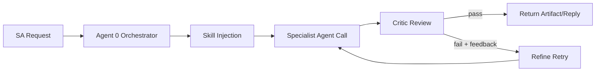

# OCI Architecture Assistant (v1.9.x)

A full Oracle SA engagement platform built as an OCI agent fleet.
**SA Assistant chat** (Agent 0) orchestrates notes intake, POV, diagram, WAF,
JEP, Terraform, and BOM advisory/generation in a single conversation thread per
customer. The current delivered baseline includes v1.6 dynamic skilling +
bounded critic/refine, v1.7 BOM integration, and v1.8 JEP lifecycle hardening.
Implements Oracle Agent Spec v26.1.0 (A2A v1.0 JSON-RPC protocol).

```
SA chat message
  → Agent 0 orchestrator (ReAct loop)
      ├── save_notes       → OCI Object Storage
      ├── generate_bom     → BOM advisory + XLSX export
      ├── generate_pov     → POV v1.md
      ├── generate_diagram → .drawio file
      ├── generate_waf     → WAF review
      ├── generate_jep     → JEP v1.md
      └── generate_terraform → .tf files

Chat      →  /api/chat + /api/chat/stream  →  tool traces + artifacts
BOM tab   →  /api/bom/chat                 →  editable BOM + JSON/XLSX
Diagram   →  /upload-bom or /api/a2a/task →  .drawio download
```

---

## Accessing the UI

The server serves the React front-end directly on port 8080. In production an
nginx reverse proxy exposes it on port 443 (HTTPS). Open a browser and go to:

```
https://<instance-ip>
```

The page lets you:
- Run SA chat with persisted customer history and artifact preview
- Use the BOM tab for advisory flow, editable line items, JSON export, and XLSX generation
- Drag-and-drop BOM.xlsx to generate diagrams
- Generate POV, JEP, WAF, and Terraform outputs

---

## Building the UI

The React app lives in `ui/`. Build it once before deploying (or after any UI
changes):

```bash
cd ui
npm install
npm run build       # outputs to ui/dist/
```

The server automatically serves `ui/dist/` — no separate web server needed.

---

## Running on OCI (Instance Principal)

The server uses **OCI Instance Principal** auth — no `~/.oci/config` needed.
The only secret you must supply is `SESSION_SECRET`.

### One-time setup: session secret

```bash
openssl rand -hex 32 > ~/.drawing-agent-secret
chmod 600 ~/.drawing-agent-secret
```

### Start the server (background)

```bash
cd ~/drawing-agent

SESSION_SECRET=$(cat ~/.drawing-agent-secret) \
nohup python3.11 -m uvicorn drawing_agent_server:app \
  --host 0.0.0.0 --port 8080 > agent.log 2>&1 &

sleep 3 && curl -s http://localhost:8080/health
```

### Restart after a code update

```bash
cd ~/drawing-agent
git pull origin claude/webapp-fastapi-tests-sWH4S
pkill -f uvicorn

SESSION_SECRET=$(cat ~/.drawing-agent-secret) \
nohup python3.11 -m uvicorn drawing_agent_server:app \
  --host 0.0.0.0 --port 8080 > agent.log 2>&1 &

sleep 3 && curl -s http://localhost:8080/health
```

---

## systemd Service (recommended for production)

Review and install the tracked unit template:

```bash
sudo cp deploy/oci-agent.service /etc/systemd/system/oci-agent.service
```

Create `/home/opc/.drawing-agent.env` (mode `600`):

```
SESSION_SECRET=<your-64-char-hex>
OIDC_CLIENT_ID=<oci-integrated-app-client-id>
OIDC_CLIENT_SECRET=<oci-integrated-app-client-secret>
OIDC_REDIRECT_URI=https://<instance-ip-or-hostname>/oauth2/callback
OIDC_ISSUER=https://idcs-<identity-domain>.identity.oraclecloud.com
```

```bash
chmod 600 /home/opc/.drawing-agent.env
```

Enable and start:

```bash
sudo systemctl daemon-reload
sudo systemctl enable --now oci-agent
sudo systemctl status oci-agent
journalctl -u oci-agent -f   # follow logs
```

Verify auth redirection:

```bash
curl -k -D - https://127.0.0.1/
curl -k -D - https://127.0.0.1/login
```

---

## nginx Reverse Proxy (HTTPS on port 443)

```nginx
# /etc/nginx/conf.d/oci-agent.conf
server {
    listen 443 ssl;
    server_name _;

    ssl_certificate     /etc/ssl/certs/oci-agent.crt;
    ssl_certificate_key /etc/ssl/private/oci-agent.key;

    location / {
        proxy_pass         http://127.0.0.1:8080;
        proxy_set_header   Host $host;
        proxy_set_header   X-Real-IP $remote_addr;
        proxy_read_timeout 120s;
    }
}
```

SELinux (Oracle Linux 9): allow nginx to connect to the backend:

```bash
sudo setsebool -P httpd_can_network_connect 1
```

OS firewall:

```bash
sudo firewall-cmd --add-service=https --permanent
sudo firewall-cmd --reload
```

### Toggle Public Web Access (Keep Local Testing)

Use the helper script to close external web access when you are not testing,
without stopping backend services.

```bash
# Show current exposure in firewalld public zone
sudo ./scripts/toggle-public-web.sh status

# Close public web ingress (removes HTTPS/HTTP services and direct app ports)
sudo ./scripts/toggle-public-web.sh close

# Re-open public web ingress for browser testing (HTTPS on 443)
sudo ./scripts/toggle-public-web.sh open
```

Notes:
- `close` does not stop `uvicorn` or nginx. On-box checks like
  `curl http://127.0.0.1:8080/health` continue to work.
- `open` enables only HTTPS (`443`) by default, assuming nginx reverse proxy
  forwards to backend `127.0.0.1:8080`.

---

## Install dependencies

```bash
# Python 3.11+ required (OCI ADK incompatible with 3.9)
pip3.11 install -r requirements.txt
```

---

## Configuration

### config.yaml — non-secret OCI settings

| Key | What it controls |
|-----|-----------------|
| `region` | OCI region (e.g. `us-chicago-1`) |
| `inference.enabled` | Use direct OCI GenAI Inference (true) vs legacy ADK (false) |
| `inference.model_id` | OCI GenAI model OCID |
| `inference.service_endpoint` | OCI GenAI endpoint URL |
| `compartment_id` | Compartment for GenAI calls |
| `persistence.enabled` | Write diagrams + docs to OCI Object Storage |
| `persistence.bucket_name` | OCI bucket name (default: `agent_assistante`) |
| `writing.max_tokens` | Token budget for POV/JEP generation |
| `writing.temperature` | Sampling temperature for document writing (default: 0.7) |
| `orchestrator.max_tool_iterations` | ReAct loop max iterations (default: 5) |
| `orchestrator.max_refinements` | Critic/refine retry cap for POV/JEP/WAF/Terraform (default: 3) |
| `orchestrator.history_max_turns` | History turns loaded per prompt (default: 30) |
| `orchestrator.telegram.enabled` | Enable Telegram notifications (default: false) |

### G-Stack Skills and Critic Layer

Agent 0 dynamically discovers and selects skills from `gstack_skills/` before
specialist dispatch (top-ranked matches are injected into the call).

Current path coverage:
- `generate_diagram` -> `diagram_for_oci`
- `generate_bom` -> `oci_bom_expert`
- `generate_pov` -> `oci_customer_pov_writer`
- `generate_jep` -> `oci_jep_writer`
- `generate_waf` -> `oci_waf_reviewer`
- `generate_terraform` -> `terraform_for_oci`

Layered behavior is intentional:
- `agent/orchestrator_skills/*` remain authoritative preflight/postflight fail-closed gates.
- `gstack_skills/*` provide dynamic specialist guidance and model routing.
- Archie deterministic expert review runs after specialist tool execution and
  before artifact exposure. It is fail-closed for hard mismatches, including
  BOM sizing contradictions, while preserving specialist/subagent ownership of
  generation.

The orchestrator runs a bounded critic/refine pass for specialist outputs
(`generate_pov`, `generate_jep`, `generate_waf`, `generate_terraform`):

1. Specialist generates initial output.
2. Critic evaluates with structured JSON (`issues`, `severity`, `suggestions`,
   `confidence`, `overall_pass`, `critique_summary`).
3. On fail, orchestrator re-dispatches with critic feedback + re-injected skills.
4. Loop stops when pass or `max_refinements` is reached.
5. Critic failures are fail-open with warning metadata.

Critic fail-open behavior does not override deterministic Archie review. A BOM
that undersizes explicit customer requirements such as OCPU, RAM, or storage is
blocked or retried before it can be presented or exported as XLSX.

Skill frontmatter can request model routing per specialist call:

```yaml
---
model_profile: terraform
---
```

`model_profile` maps to `config.yaml -> agents.<profile>` and falls back to default inference settings when not configured.

### Requirements and Checklists

- Master requirements + current delivery status: `docs/requirements-current-status.md`
- Historical baseline requirements (v1.5): `docs/requirements-v1.5.0.md`
- v1.6 implementation checklist: `docs/v1.6-implementation-checklist.md`
- v1.7 BOM integration requirements: `docs/requirements-v1.7.0-bom-agent-integration.md`
- v1.7 implementation checklist: `docs/v1.7-implementation-checklist.md`
- v1.8 JEP lifecycle requirements: `docs/requirements-v1.8.0-orchestrator-skill-hardening-and-jep-lifecycle.md`

Each tool call now includes trace metadata in `tool_calls[].result_data.trace`,
including `applied_skills`, `model_profile`, `refinement_count`,
`max_refinements`, `overall_pass`, `warnings`, `archie_lens`,
`sent_to_specialist`, `review_verdict`, `review_findings`, and
`refinement_history`.

For JEP flows, trace and API payloads also include lifecycle contract metadata
(`jep_state`, lock outcome, and required-next-step policy hints).



This behavior is implemented in:

- `agent/skill_loader.py`
- `agent/critic_agent.py`
- `agent/orchestrator_agent.py`

### .env — secrets and per-deployment values

Copy `.env.example` to `.env` and fill in the values. On OCI Compute set these
via systemd `EnvironmentFile` or OCI Vault instead.

| Variable | Required | Description |
|----------|----------|-------------|
| `SESSION_SECRET` | ✅ | Long random string for signing session cookies. Generate: `openssl rand -hex 32`. Keep stable across restarts. |
| `OIDC_CLIENT_ID` | for auth | Confidential app client ID from OCI Identity Domain |
| `OIDC_CLIENT_SECRET` | for auth | Confidential app client secret |
| `OIDC_REDIRECT_URI` | for auth | Callback URL registered in the Identity Domain app |
| `OIDC_ISSUER` | for auth | Identity Domain base URL, for example `https://idcs-...identity.oraclecloud.com`. `OCI_IDENTITY_DOMAIN_URL` is also accepted. |
| `OIDC_AUTHORIZATION_ENDPOINT` | optional | Explicit Identity Domain OAuth authorize URL; overrides derived `OIDC_ISSUER` URL |
| `OIDC_TOKEN_ENDPOINT` | optional | Explicit Identity Domain OAuth token URL; overrides derived `OIDC_ISSUER` URL |
| `OIDC_USERINFO_ENDPOINT` | optional | Explicit Identity Domain OIDC userinfo URL; overrides derived `OIDC_ISSUER` URL |
| `OIDC_LOGOUT_ENDPOINT` | optional | Identity Domain logout URL |
| `OIDC_REQUIRED_GROUP` | optional | Require membership in this Identity Domain group |
| `SESSION_COOKIE_SECURE` | optional | `auto` by default; sends Secure cookies when `OIDC_REDIRECT_URI` uses HTTPS |

Auth is automatically enabled when `OIDC_CLIENT_ID`, `OIDC_CLIENT_SECRET`,
`OIDC_REDIRECT_URI`, and either `OIDC_ISSUER`/`OCI_IDENTITY_DOMAIN_URL` or the
explicit endpoint variables are set. Leave them unset to run without
authentication.

---

## API endpoints

### Orchestrator — Agent 0 (A2A v1.0)

| Method | Path | Description |
|--------|------|-------------|
| `POST` | `/message:send` | A2A v1.0 JSON-RPC entry point (Oracle Agent Spec 26.1.0) |
| `GET` | `/tasks/{task_id}` | Poll A2A task status |
| `POST` | `/tasks/{task_id}:cancel` | Cancel a pending task |
| `POST` | `/api/chat` | Convenience REST: `{customer_id, customer_name, message}` |
| `POST` | `/api/chat/stream` | Streaming chat response (`sse` or `chunked`) |
| `GET` | `/api/chat/{customer_id}/history` | Return conversation history |
| `GET` | `/api/chat/history` | Aggregated cross-customer chat index for sidebar/search |
| `DELETE` | `/api/chat/{customer_id}/history` | Clear conversation history |

### BOM Advisor

| Method | Path | Description |
|--------|------|-------------|
| `GET` | `/api/bom/config` | BOM service readiness/config metadata |
| `GET` | `/api/bom/health` | BOM service health |
| `POST` | `/api/bom/chat` | BOM advisory/clarify/final chat flow |
| `POST` | `/api/bom/generate-xlsx` | Generate BOM workbook from final line items |
| `POST` | `/api/bom/refresh-data` | Manual refresh of BOM source caches |

### Diagram — Agent 3

| Method | Path | Description |
|--------|------|-------------|
| `GET` | `/` | Web UI |
| `POST` | `/upload-bom` | Upload BOM.xlsx → diagram or clarification questions |
| `POST` | `/clarify` | Submit answers to clarification questions |
| `POST` | `/generate` | Generate from a JSON resource list |
| `POST` | `/upload-to-bucket` | Upload a file to OCI Object Storage |
| `GET` | `/download/{filename}` | Download generated `.drawio` file |
| `POST` | `/api/a2a/task` | Legacy A2A task endpoint (schema_version 0.1) |

### Notes

| Method | Path | Description |
|--------|------|-------------|
| `POST` | `/notes/upload` | Upload a meeting notes file for a customer |
| `GET` | `/notes/{customer_id}` | List all notes for a customer |

### POV — Point of View document

| Method | Path | Description |
|--------|------|-------------|
| `POST` | `/pov/generate` | Generate or update a POV document from notes |
| `GET` | `/pov/{customer_id}/latest` | Retrieve the latest POV |
| `GET` | `/pov/{customer_id}/versions` | List all POV versions |

### JEP — Joint Execution Plan

| Method | Path | Description |
|--------|------|-------------|
| `POST` | `/jep/generate` | Generate or update a JEP from notes + diagram (returns embedded `jep_state`; returns policy block when approved lock is active) |
| `GET` | `/jep/{customer_id}/latest` | Retrieve the latest JEP (includes `jep_state`) |
| `GET` | `/jep/{customer_id}/versions` | List all JEP versions |
| `POST` | `/jep/approve` | Save SA-approved JEP (transitions lifecycle to `approved`) |
| `GET` | `/jep/{customer_id}/approved` | Retrieve approved JEP |
| `POST` | `/jep/revision-request` | Request revision of an approved JEP (transitions to `revision_requested`) |
| `POST` | `/jep/kickoff` | Generate kickoff questions from notes |
| `POST` | `/jep/answers` | Save kickoff answers |
| `GET` | `/jep/{customer_id}/questions` | Retrieve kickoff questions/answers |

`jep_state` contract fields:
- `state`
- `is_locked`
- `missing_fields`
- `required_next_step`
- `source_context.references`
- `source_context.snippets`

### System

| Method | Path | Description |
|--------|------|-------------|
| `GET` | `/health` | Health check |
| `GET` | `/config` | UI configuration (region, model info) |
| `POST` | `/refresh-data` | Reload LLM runner without restart |
| `GET` | `/.well-known/agent.json` | Oracle Agent Spec v26.1.0 card (schemaVersion 1.0) |
| `GET` | `/.well-known/agent-card-legacy.json` | Legacy schema_version 0.1 card |
| `GET` | `/mcp/tools` | MCP tool manifest |

---

## API smoke tests

```bash
HOST=https://<instance-ip>

# Health
curl -sk $HOST/health | python3 -m json.tool

# Upload BOM directly (multipart)
curl -sk -X POST $HOST/api/upload-bom \
  -F "file=@BOM.xlsx" \
  -F "diagram_name=test_diagram" \
  -F "client_id=test1" | python3 -m json.tool

# Upload a file to OCI bucket (step 1 of drag-and-drop flow)
curl -sk -X POST $HOST/api/upload-to-bucket \
  -F "customer_id=acme" \
  -F "file=@BOM.xlsx" | python3 -m json.tool

# Generate via A2A (bucket-side BOM — step 2 of drag-and-drop flow)
curl -sk -X POST $HOST/api/a2a/task \
  -H "Content-Type: application/json" \
  -d '{
    "task_id": "test-001",
    "skill": "upload_bom",
    "client_id": "acme",
    "inputs": {
      "bom_from_bucket": {
        "namespace": "oraclejamescalise",
        "bucket": "agent_assistante",
        "object": "agent3/acme/BOM.xlsx"
      },
      "diagram_name": "acme_architecture"
    }
  }' | python3 -m json.tool

# Upload meeting notes
curl -sk -X POST $HOST/api/notes/upload \
  -F "customer_id=acme" \
  -F "note_name=kickoff.md" \
  -F "file=@notes.md" | python3 -m json.tool

# Generate POV
curl -sk -X POST $HOST/api/pov/generate \
  -H "Content-Type: application/json" \
  -d '{"customer_id": "acme", "customer_name": "ACME Corp"}' | python3 -m json.tool

# Generate JEP
curl -sk -X POST $HOST/api/jep/generate \
  -H "Content-Type: application/json" \
  -d '{"customer_id": "acme", "customer_name": "ACME Corp"}' | python3 -m json.tool

# Request revision after approved-lock
curl -sk -X POST $HOST/api/jep/revision-request \
  -H "Content-Type: application/json" \
  -d '{"customer_id": "acme", "reason": "Expand milestones and ownership details"}' | python3 -m json.tool

# Download diagram
curl -sk -o diagram.drawio \
  "$HOST/api/download/diagram.drawio?client_id=test1&diagram_name=test_diagram"
```

---

## OCI Object Storage layout

**Bucket**: `agent_assistante` | **Namespace**: `oraclejamescalise`

```
agent_assistante/
├── agent3/{client_id}/{diagram_name}/
│   ├── {request_id}/
│   │   ├── diagram.drawio
│   │   ├── spec.json
│   │   └── render_manifest.json
│   └── LATEST.json          ← atomic pointer to latest successful run
│
├── notes/{customer_id}/
│   ├── {note_name}          ← meeting notes (text/markdown)
│   └── MANIFEST.json
│
├── pov/{customer_id}/
│   ├── v1.md  v2.md  ...
│   ├── LATEST.md
│   └── MANIFEST.json
│
└── jep/{customer_id}/
    ├── v1.md  v2.md  ...
    ├── LATEST.md
    ├── lifecycle.json
    ├── poc_questions.json
    └── MANIFEST.json
```

---

## Run tests locally

```bash
# Fast deterministic PR gate (unit + integration + system + e2e + prompt_static)
./scripts/test_pr_gate.sh -v

# Nightly/manual prompt quality lane (adds prompt_judge; live remains opt-in)
./scripts/test_nightly_prompt.sh -v

# Local/manual fallback when LLM judge infra is unavailable (skips prompt_judge instead of failing)
PROMPT_JUDGE_STRICT=0 ./scripts/test_nightly_prompt.sh -v

# Optional: include live lane in nightly/manual
RUN_LIVE_TESTS=1 RUN_LIVE_LLM_TESTS=1 ./scripts/test_nightly_prompt.sh -v

# Run configured live LLM scenario tests directly (OCI inference, no Anthropic dependency)
RUN_LIVE_LLM_TESTS=1 pytest tests/test_llm_live.py -v -s

# Run live server smoke/integration tests (requires reachable server base URL)
AGENT_BASE_URL=http://127.0.0.1:8080 pytest tests/test_server_live.py -v -s

# Fetch pinned external OCI architecture fixtures, then validate the local corpus
python3 scripts/fetch_external_oci_arch_skill_fixtures.py
pytest tests/test_external_oci_arch_corpus.py -v
```

Test strategy reference:
- `docs/hybrid-test-framework-recursive-prompt-quality-v1.md`

Marker taxonomy:
- `unit`
- `integration`
- `system`
- `e2e`
- `prompt_static`
- `prompt_judge` (opt-in)
- `live` (opt-in)

---

## Repository structure

```
drawing-agent/
├── drawing_agent_server.py     # FastAPI server — all API endpoints incl. /message:send + /api/chat
├── config.yaml                 # Region, model, persistence, orchestrator config
├── requirements.txt
├── Dockerfile
│
├── agent/
│   ├── orchestrator_agent.py   # Agent 0 — ReAct loop, tool dispatch, conversation history
│   ├── bom_service.py          # Shared v1.7 BOM advisory service + cache/repair logic
│   ├── skill_loader.py         # Lightweight gstack skill loader + frontmatter parser
│   ├── critic_agent.py         # Critic pass/fail evaluator used for refine retries
│   ├── orchestrator_skill_engine.py  # Fail-closed skill governance runtime
│   ├── notifications.py        # Event notification stub (Telegram-ready)
│   ├── bom_parser.py           # BOM → ServiceItem list + LLM prompt
│   ├── layout_engine.py        # Layout spec → x,y positions
│   ├── drawio_generator.py     # Positions → draw.io XML
│   ├── oci_standards.py        # OCI icon stencils (147KB)
│   ├── layout_intent.py        # LayoutIntent schema
│   ├── intent_compiler.py      # LayoutIntent → flat spec
│   ├── persistence_objectstore.py
│   ├── pov_agent.py            # POV document generator
│   ├── jep_agent.py            # JEP generator
│   ├── waf_agent.py            # WAF review agent
│   ├── graphs/terraform_graph.py  # Terraform generation chain entrypoint
│   ├── bom_stub.py             # BOM extractor from meeting notes
│   ├── document_store.py       # Versioned doc storage + conversation history
│   └── context_store.py        # Shared engagement state across agents
│
├── gstack_skills/
│   ├── oci_bom_expert/
│   │   └── SKILL.md            # BOM advisory skill
│   ├── diagram_for_oci/
│   │   └── SKILL.md            # Diagram specialist guidance
│   ├── terraform_for_oci/
│   │   └── SKILL.md            # Terraform domain skill (model_profile: terraform)
│   ├── oci_customer_pov_writer/
│   │   └── SKILL.md            # POV writing skill (model_profile: pov)
│   ├── oci_jep_writer/
│   │   └── SKILL.md            # JEP writing skill (model_profile: jep)
│   └── oci_waf_reviewer/
│       └── SKILL.md            # WAF reviewer skill
│
├── ui/                         # React + Vite front-end (dark OCI theme)
│   ├── src/
│   │   ├── App.tsx             # Mode switcher; chat is the default tab
│   │   ├── api/client.ts       # All API calls incl. apiChat, apiGetChatHistory
│   │   └── components/
│   │       ├── ChatInterface.tsx   # SA Assistant chat UI (Agent 0)
│   │       ├── BomAdvisor.tsx      # BOM advisory tab UI (v1.7)
│   │       ├── UploadBom.tsx
│   │       ├── PovForm.tsx
│   │       ├── JepForm.tsx
│   │       ├── WafForm.tsx
│   │       └── TerraformForm.tsx
│   ├── dist/                   # Built output — served by FastAPI
│   └── package.json
│
├── docs/
│   ├── orchestrator.md         # Agent 0 design & implementation spec
│   ├── hybrid-test-framework-recursive-prompt-quality-v1.md  # test framework + prompt quality plan
│   ├── spec.md                 # Agent 3 (drawing) specification
│   ├── pipeline.md             # Full pipeline reference
│   └── bucket_structure.md     # OCI Object Storage layout
│
└── tests/
    ├── test_bom_parser.py
    ├── test_layout_engine.py
    ├── test_intent_compiler.py
    ├── test_a2a.py             # A2A v1.0 agent card + skill tests
    └── fixtures/
        └── sample_bom.xlsx
```

Where skills are used:
- Agent 0 injects `gstack_skills/*/SKILL.md` in `agent/orchestrator_agent.py` via `agent/skill_loader.py`.
- Skill frontmatter `model_profile` routes model selection through `drawing_agent_server.py` (`_make_orchestrator_text_runner`).

---

## Agent fleet

All agents run in the same process. Agent 0 is the conversational entry point.

| # | Agent | Status | Endpoint |
|---|-------|--------|----------|
| **0** | **SA Orchestrator (Agent 0)** | **live** | `/message:send`, `/api/chat`, `/api/chat/stream` |
| **2** | **BOM sizing + pricing advisory** | **live** | `/api/bom/chat`, `/api/bom/generate-xlsx` |
| **3** | **Architecture diagram** | **live** | `/upload-bom`, `/generate`, `/api/a2a/task` |
| **4** | **POV document** | **live** | `/pov/generate` |
| **5** | **JEP document** | **live** | `/jep/generate` |
| **6** | **Terraform generation** | **live** | `/terraform/generate` |
| **7** | **WAF review** | **live** | `/waf/generate` |

See `docs/orchestrator.md` for the Agent 0 design spec and A2A v1.0 protocol details.

---

## OCI environment

| Setting | Value |
|---------|-------|
| Host | `opc@10.0.3.47` |
| Internal port | **8080** |
| External port | **443** (nginx) |
| Python | 3.11+ |
| Auth | Instance Principal |
| Region | `us-phoenix-1` |
