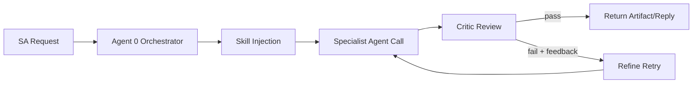

# OCI Architecture Assistant (v1.5.0)

A full Oracle SA engagement platform built as an OCI agent fleet. The new
**SA Assistant chat tab** (Agent 0) provides a conversational interface that
orchestrates all sub-agents — notes intake, POV, diagram, WAF review, JEP, and
Terraform — in a single conversation thread per customer. Implements Oracle
Agent Spec v26.1.0 (A2A v1.0 JSON-RPC protocol).

```
SA chat message
  → Agent 0 orchestrator (ReAct loop)
      ├── save_notes       → OCI Object Storage
      ├── generate_pov     → POV v1.md
      ├── generate_diagram → .drawio file
      ├── generate_waf     → WAF review
      ├── generate_jep     → JEP v1.md
      └── generate_terraform → .tf files

BOM.xlsx  →  drag-and-drop to OCI bucket  →  A2A generate  →  .drawio download
Notes     →  /notes/upload                →  /pov/generate  →  Markdown POV
                                          →  /jep/generate  →  Markdown JEP
```

---

## Accessing the UI

The server serves the React front-end directly on port 8080. In production an
nginx reverse proxy exposes it on port 443 (HTTPS). Open a browser and go to:

```
https://<instance-ip>
```

The page lets you:
- Drag-and-drop a BOM.xlsx (uploads to OCI bucket, then generates the diagram)
- Attach a requirements file or paste architecture context
- Fill in a 10-question architecture questionnaire (blank fields are inferred by the LLM)
- Download the generated `.drawio` file

---

## Building the UI

The React app lives in `ui/`. Build it once before deploying (or after any UI
changes):

```bash
cd ui
npm install
npm run build       # outputs to ui/dist/
```

The server automatically serves `ui/dist/` — no separate web server needed.

---

## Running on OCI (Instance Principal)

The server uses **OCI Instance Principal** auth — no `~/.oci/config` needed.
The only secret you must supply is `SESSION_SECRET`.

### One-time setup: session secret

```bash
openssl rand -hex 32 > ~/.drawing-agent-secret
chmod 600 ~/.drawing-agent-secret
```

### Start the server (background)

```bash
cd ~/drawing-agent

SESSION_SECRET=$(cat ~/.drawing-agent-secret) \
nohup python3.11 -m uvicorn drawing_agent_server:app \
  --host 0.0.0.0 --port 8080 > agent.log 2>&1 &

sleep 3 && curl -s http://localhost:8080/health
```

### Restart after a code update

```bash
cd ~/drawing-agent
git pull origin claude/webapp-fastapi-tests-sWH4S
pkill -f uvicorn

SESSION_SECRET=$(cat ~/.drawing-agent-secret) \
nohup python3.11 -m uvicorn drawing_agent_server:app \
  --host 0.0.0.0 --port 8080 > agent.log 2>&1 &

sleep 3 && curl -s http://localhost:8080/health
```

---

## systemd Service (recommended for production)

Create `/etc/systemd/system/oci-agent.service`:

```ini
[Unit]
Description=OCI Architecture Assistant
After=network.target

[Service]
User=opc
WorkingDirectory=/home/opc/drawing-agent
EnvironmentFile=/home/opc/.drawing-agent.env
ExecStart=/usr/bin/python3.11 -m uvicorn drawing_agent_server:app \
    --host 0.0.0.0 --port 8080
Restart=always
RestartSec=5
StandardOutput=journal
StandardError=journal

[Install]
WantedBy=multi-user.target
```

Create `/home/opc/.drawing-agent.env` (mode `600`):

```
SESSION_SECRET=<your-64-char-hex>
```

Enable and start:

```bash
sudo systemctl daemon-reload
sudo systemctl enable --now oci-agent
sudo systemctl status oci-agent
journalctl -u oci-agent -f   # follow logs
```

---

## nginx Reverse Proxy (HTTPS on port 443)

```nginx
# /etc/nginx/conf.d/oci-agent.conf
server {
    listen 443 ssl;
    server_name _;

    ssl_certificate     /etc/ssl/certs/oci-agent.crt;
    ssl_certificate_key /etc/ssl/private/oci-agent.key;

    location / {
        proxy_pass         http://127.0.0.1:8080;
        proxy_set_header   Host $host;
        proxy_set_header   X-Real-IP $remote_addr;
        proxy_read_timeout 120s;
    }
}
```

SELinux (Oracle Linux 9): allow nginx to connect to the backend:

```bash
sudo setsebool -P httpd_can_network_connect 1
```

OS firewall:

```bash
sudo firewall-cmd --add-service=https --permanent
sudo firewall-cmd --reload
```

### Toggle Public Web Access (Keep Local Testing)

Use the helper script to close external web access when you are not testing,
without stopping backend services.

```bash
# Show current exposure in firewalld public zone
sudo ./scripts/toggle-public-web.sh status

# Close public web ingress (removes HTTPS/HTTP services and direct app ports)
sudo ./scripts/toggle-public-web.sh close

# Re-open public web ingress for browser testing (HTTPS on 443)
sudo ./scripts/toggle-public-web.sh open
```

Notes:
- `close` does not stop `uvicorn` or nginx. On-box checks like
  `curl http://127.0.0.1:8080/health` continue to work.
- `open` enables only HTTPS (`443`) by default, assuming nginx reverse proxy
  forwards to backend `127.0.0.1:8080`.

---

## Install dependencies

```bash
# Python 3.11+ required (OCI ADK incompatible with 3.9)
pip3.11 install -r requirements.txt
```

---

## Configuration

### config.yaml — non-secret OCI settings

| Key | What it controls |
|-----|-----------------|
| `region` | OCI region (e.g. `us-chicago-1`) |
| `inference.enabled` | Use direct OCI GenAI Inference (true) vs legacy ADK (false) |
| `inference.model_id` | OCI GenAI model OCID |
| `inference.service_endpoint` | OCI GenAI endpoint URL |
| `compartment_id` | Compartment for GenAI calls |
| `persistence.enabled` | Write diagrams + docs to OCI Object Storage |
| `persistence.bucket_name` | OCI bucket name (default: `agent_assistante`) |
| `writing.max_tokens` | Token budget for POV/JEP generation |
| `writing.temperature` | Sampling temperature for document writing (default: 0.7) |
| `orchestrator.max_tool_iterations` | ReAct loop max iterations (default: 5) |
| `orchestrator.history_max_turns` | History turns loaded per prompt (default: 30) |
| `orchestrator.telegram.enabled` | Enable Telegram notifications (default: false) |

### G-Stack Skills and Critic Layer

Agent 0 now injects domain skill guidance into specialist calls before dispatch:

- `generate_pov` -> `gstack_skills/oci_customer_pov_writer/SKILL.md`
- `generate_terraform` -> `gstack_skills/terraform_for_oci/SKILL.md`

The orchestrator also runs a bounded critic/refine pass for specialist outputs:

1. Specialist generates initial output.
2. Critic evaluates pass/fail and returns actionable feedback.
3. On fail, orchestrator retries once with critic feedback injected.

Skill frontmatter can request model routing per specialist call:

```yaml
---
model_profile: terraform
---
```

`model_profile` maps to `config.yaml -> agents.<profile>` and falls back to
default inference settings when not configured.



This behavior is implemented in:

- `agent/skill_loader.py`
- `agent/critic_agent.py`
- `agent/orchestrator_agent.py`

### .env — secrets and per-deployment values

Copy `.env.example` to `.env` and fill in the values. On OCI Compute set these
via systemd `EnvironmentFile` or OCI Vault instead.

| Variable | Required | Description |
|----------|----------|-------------|
| `SESSION_SECRET` | ✅ | Long random string for signing session cookies. Generate: `openssl rand -hex 32`. Keep stable across restarts. |
| `OIDC_CLIENT_ID` | for auth | Confidential app client ID from OCI Identity Domain |
| `OIDC_CLIENT_SECRET` | for auth | Confidential app client secret |
| `OIDC_AUTHORIZATION_ENDPOINT` | for auth | Identity Domain OAuth authorize URL |
| `OIDC_TOKEN_ENDPOINT` | for auth | Identity Domain OAuth token URL |
| `OIDC_USERINFO_ENDPOINT` | for auth | Identity Domain OIDC userinfo URL |
| `OIDC_REDIRECT_URI` | for auth | Callback URL registered in the Identity Domain app |
| `OIDC_LOGOUT_ENDPOINT` | optional | Identity Domain logout URL |
| `OIDC_REQUIRED_GROUP` | optional | Require membership in this Identity Domain group |

Auth is automatically enabled when the four required OIDC vars are set.
Leave them unset to run without authentication.

---

## API endpoints

### Orchestrator — Agent 0 (A2A v1.0)

| Method | Path | Description |
|--------|------|-------------|
| `POST` | `/message:send` | A2A v1.0 JSON-RPC entry point (Oracle Agent Spec 26.1.0) |
| `GET` | `/tasks/{task_id}` | Poll A2A task status |
| `POST` | `/tasks/{task_id}:cancel` | Cancel a pending task |
| `POST` | `/api/chat` | Convenience REST: `{customer_id, customer_name, message}` |
| `GET` | `/api/chat/{customer_id}/history` | Return conversation history |
| `DELETE` | `/api/chat/{customer_id}/history` | Clear conversation history |

### Diagram — Agent 3

| Method | Path | Description |
|--------|------|-------------|
| `GET` | `/` | Web UI |
| `POST` | `/upload-bom` | Upload BOM.xlsx → diagram or clarification questions |
| `POST` | `/clarify` | Submit answers to clarification questions |
| `POST` | `/generate` | Generate from a JSON resource list |
| `POST` | `/upload-to-bucket` | Upload a file to OCI Object Storage |
| `GET` | `/download/{file}` | Download generated `.drawio` file |
| `POST` | `/api/a2a/task` | Legacy A2A task endpoint (schema_version 0.1) |

### Notes

| Method | Path | Description |
|--------|------|-------------|
| `POST` | `/notes/upload` | Upload a meeting notes file for a customer |
| `GET` | `/notes/{customer_id}` | List all notes for a customer |

### POV — Point of View document

| Method | Path | Description |
|--------|------|-------------|
| `POST` | `/pov/generate` | Generate or update a POV document from notes |
| `GET` | `/pov/{customer_id}/latest` | Retrieve the latest POV |
| `GET` | `/pov/{customer_id}/versions` | List all POV versions |

### JEP — Joint Execution Plan

| Method | Path | Description |
|--------|------|-------------|
| `POST` | `/jep/generate` | Generate or update a JEP from notes + diagram |
| `GET` | `/jep/{customer_id}/latest` | Retrieve the latest JEP |
| `GET` | `/jep/{customer_id}/versions` | List all JEP versions |

### System

| Method | Path | Description |
|--------|------|-------------|
| `GET` | `/health` | Health check |
| `GET` | `/config` | UI configuration (region, model info) |
| `POST` | `/refresh-data` | Reload LLM runner without restart |
| `GET` | `/.well-known/agent.json` | Oracle Agent Spec v26.1.0 card (schemaVersion 1.0) |
| `GET` | `/.well-known/agent-card-legacy.json` | Legacy schema_version 0.1 card |
| `GET` | `/mcp/tools` | MCP tool manifest |

---

## API smoke tests

```bash
HOST=https://<instance-ip>

# Health
curl -sk $HOST/health | python3 -m json.tool

# Upload BOM directly (multipart)
curl -sk -X POST $HOST/api/upload-bom \
  -F "file=@BOM.xlsx" \
  -F "diagram_name=test_diagram" \
  -F "client_id=test1" | python3 -m json.tool

# Upload a file to OCI bucket (step 1 of drag-and-drop flow)
curl -sk -X POST $HOST/api/upload-to-bucket \
  -F "customer_id=acme" \
  -F "file=@BOM.xlsx" | python3 -m json.tool

# Generate via A2A (bucket-side BOM — step 2 of drag-and-drop flow)
curl -sk -X POST $HOST/api/a2a/task \
  -H "Content-Type: application/json" \
  -d '{
    "task_id": "test-001",
    "skill": "upload_bom",
    "client_id": "acme",
    "inputs": {
      "bom_from_bucket": {
        "namespace": "oraclejamescalise",
        "bucket": "agent_assistante",
        "object": "agent3/acme/BOM.xlsx"
      },
      "diagram_name": "acme_architecture"
    }
  }' | python3 -m json.tool

# Upload meeting notes
curl -sk -X POST $HOST/api/notes/upload \
  -F "customer_id=acme" \
  -F "note_name=kickoff.md" \
  -F "file=@notes.md" | python3 -m json.tool

# Generate POV
curl -sk -X POST $HOST/api/pov/generate \
  -H "Content-Type: application/json" \
  -d '{"customer_id": "acme", "customer_name": "ACME Corp"}' | python3 -m json.tool

# Generate JEP
curl -sk -X POST $HOST/api/jep/generate \
  -H "Content-Type: application/json" \
  -d '{"customer_id": "acme", "customer_name": "ACME Corp"}' | python3 -m json.tool

# Download diagram
curl -sk -o diagram.drawio \
  "$HOST/api/download/diagram.drawio?client_id=test1&diagram_name=test_diagram"
```

---

## OCI Object Storage layout

**Bucket**: `agent_assistante` | **Namespace**: `oraclejamescalise`

```
agent_assistante/
├── agent3/{client_id}/{diagram_name}/
│   ├── {request_id}/
│   │   ├── diagram.drawio
│   │   ├── spec.json
│   │   └── render_manifest.json
│   └── LATEST.json          ← atomic pointer to latest successful run
│
├── notes/{customer_id}/
│   ├── {note_name}          ← meeting notes (text/markdown)
│   └── MANIFEST.json
│
├── pov/{customer_id}/
│   ├── v1.md  v2.md  ...
│   ├── LATEST.md
│   └── MANIFEST.json
│
└── jep/{customer_id}/
    ├── v1.md  v2.md  ...
    ├── LATEST.md
    └── MANIFEST.json
```

---

## Run tests locally

```bash
# Fast deterministic PR gate (unit + integration + system + e2e + prompt_static)
./scripts/test_pr_gate.sh -v

# Nightly/manual prompt quality lane (adds prompt_judge; live remains opt-in)
./scripts/test_nightly_prompt.sh -v

# Local/manual fallback when LLM judge infra is unavailable (skips prompt_judge instead of failing)
PROMPT_JUDGE_STRICT=0 ./scripts/test_nightly_prompt.sh -v

# Optional: include live lane in nightly/manual
RUN_LIVE_TESTS=1 RUN_LIVE_LLM_TESTS=1 ./scripts/test_nightly_prompt.sh -v

# Run configured live LLM scenario tests directly (OCI inference, no Anthropic dependency)
RUN_LIVE_LLM_TESTS=1 pytest tests/test_llm_live.py -v -s

# Run live server smoke/integration tests (requires reachable server base URL)
AGENT_BASE_URL=http://127.0.0.1:8080 pytest tests/test_server_live.py -v -s
```

Test strategy reference:
- `docs/hybrid-test-framework-recursive-prompt-quality-v1.md`

Marker taxonomy:
- `unit`
- `integration`
- `system`
- `e2e`
- `prompt_static`
- `prompt_judge` (opt-in)
- `live` (opt-in)

---

## Repository structure

```
arch_assistant/
├── drawing_agent_server.py     # FastAPI server — all API endpoints incl. /message:send + /api/chat
├── config.yaml                 # Region, model, persistence, orchestrator config
├── requirements.txt
├── Dockerfile
│
├── agent/
│   ├── orchestrator_agent.py   # Agent 0 — ReAct loop, tool dispatch, conversation history
│   ├── notifications.py        # Event notification stub (Telegram-ready)
│   ├── bom_parser.py           # BOM → ServiceItem list + LLM prompt
│   ├── layout_engine.py        # Layout spec → x,y positions
│   ├── drawio_generator.py     # Positions → draw.io XML
│   ├── oci_standards.py        # OCI icon stencils (147KB)
│   ├── layout_intent.py        # LayoutIntent schema
│   ├── intent_compiler.py      # LayoutIntent → flat spec
│   ├── persistence_objectstore.py
│   ├── pov_agent.py            # POV document generator
│   ├── jep_agent.py            # JEP generator
│   ├── waf_agent.py            # WAF review agent
│   ├── terraform_agent.py      # Terraform code generator
│   ├── bom_stub.py             # BOM extractor from meeting notes
│   ├── document_store.py       # Versioned doc storage + conversation history
│   └── context_store.py        # Shared engagement state across agents
│
├── ui/                         # React + Vite front-end (dark OCI theme)
│   ├── src/
│   │   ├── App.tsx             # Mode switcher; chat is the default tab
│   │   ├── api/client.ts       # All API calls incl. apiChat, apiGetChatHistory
│   │   └── components/
│   │       ├── ChatInterface.tsx   # SA Assistant chat UI (Agent 0)
│   │       ├── UploadBom.tsx
│   │       ├── PovForm.tsx
│   │       ├── JepForm.tsx
│   │       ├── WafForm.tsx
│   │       └── TerraformForm.tsx
│   ├── dist/                   # Built output — served by FastAPI
│   └── package.json
│
├── docs/
│   ├── orchestrator.md         # Agent 0 design & implementation spec
│   ├── hybrid-test-framework-recursive-prompt-quality-v1.md  # test framework + prompt quality plan
│   ├── spec.md                 # Agent 3 (drawing) specification
│   ├── pipeline.md             # Full pipeline reference
│   └── bucket_structure.md     # OCI Object Storage layout
│
└── tests/
    ├── test_bom_parser.py
    ├── test_layout_engine.py
    ├── test_intent_compiler.py
    ├── test_a2a.py             # A2A v1.0 agent card + skill tests
    └── fixtures/
        └── sample_bom.xlsx
```

---

## Agent fleet

All agents run in the same process. Agent 0 is the conversational entry point.

| # | Agent | Status | Endpoint |
|---|-------|--------|----------|
| **0** | **SA Orchestrator (Agent 0)** | **live** | `/message:send`, `/api/chat` |
| 1 | Requirements gathering | planned | — |
| 2 | BOM sizing + pricing | planned | — |
| **3** | **Architecture diagram** | **live** | `/upload-bom`, `/generate`, `/api/a2a/task` |
| **4** | **POV document** | **live** | `/pov/generate` |
| **5** | **JEP document** | **live** | `/jep/generate` |
| **6** | **Terraform generation** | **live** | `/terraform/generate` |
| **7** | **WAF review** | **live** | `/waf/generate` |

See `docs/orchestrator.md` for the Agent 0 design spec and A2A v1.0 protocol details.

---

## OCI environment

| Setting | Value |
|---------|-------|
| Host | `opc@10.0.3.47` |
| Internal port | **8080** |
| External port | **443** (nginx) |
| Python | 3.11+ |
| Auth | Instance Principal |
| Region | `us-phoenix-1` |
